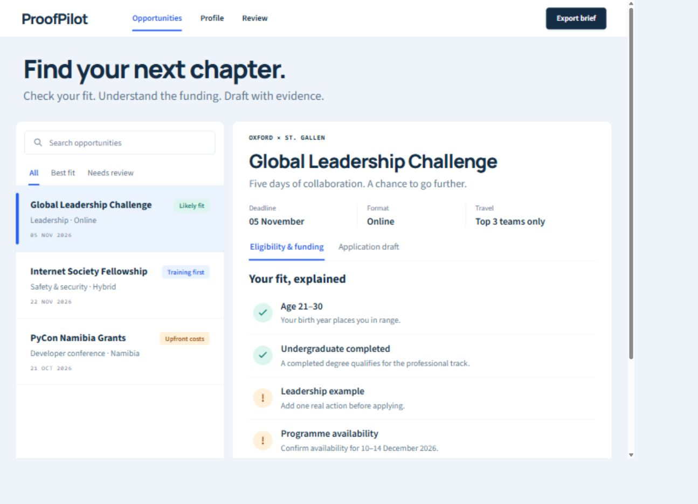

# ProofPilot

An evidence-first workspace for international opportunities: check eligibility, understand funding conditions, and prepare a draft whose factual statements have visible provenance.



## What works

- Search and filter curated opportunities against an editable, anonymous demo profile.
- Explain age, education, training and availability requirements, including uncertain age boundaries and stale source checks.
- Distinguish travel awards from reimbursements requiring money upfront.
- Prepare a clearly labeled template draft and show the self-reported or organizer source behind each selected fact.
- Review a Markdown brief, copy its preview or request a file download.
- Optionally ask a local AI model to select a writing plan. The model cannot add free-form claims to the final draft.

## Run locally

Requires Node.js 24 or newer.

```sh
npm ci --ignore-scripts
npm run check
npm start
```

Open **http://127.0.0.1:5189**. For development, use `npm run dev` and open http://127.0.0.1:5188. The servers bind to loopback.

The complete eligibility, review and template workflow works without an API key. Profile changes stay in memory and disappear on reload.

## Optional local AI

An already installed Ollama instance at `http://127.0.0.1:11434` is detected automatically. Choose one of its installed models in the draft panel. ProofPilot neither installs a model nor creates a provider account.

For an existing **unauthenticated loopback** OpenAI-compatible gateway, set `LOCAL_AI_KIND=gateway` and `LOCAL_AI_URL=http://127.0.0.1:20128` before starting. These are connection settings, not credentials. Gateways requiring authentication are not supported by this version; do not disable their security to connect.

Only generic fact labels and identifiers are sent to the model. Applicant text is assembled locally from the reviewed catalog. A gateway may itself call a remote service; its model pricing and data policies still apply. This does not make every gateway model free.

The local-provider adapter is covered by contract tests. A live model response has **not** been verified in the development environment: Ollama was unavailable and the existing gateway's advertised free model was unavailable. The UI reports this honestly and offers template drafting.

## Evidence and limits

The three initial records are curated snapshots checked on October 7, 2026, with official source links. They are not a live opportunity feed. Verify current organizer requirements, deadlines and funding before applying; date-only deadlines do not imply a verified timezone. After 14 days, the app flags source rechecking.

“Likely fit” is provisional. Missing personal examples and availability still require review. Self-reported facts are not independently verified. This app does not submit applications, certify claims, upload documents, or guarantee selection.

It is a local, single-user prototype. Do not expose it as a public service without adding authentication and reviewing deployment security. No application documents, employer data or real applicant contact details are bundled.

## Structure

| Directory | Purpose |
|---|---|
| `data/` | Source-linked opportunity snapshots and anonymous demo profile |
| `lib/` | Eligibility, deadlines, sensitive-text checks, grounded draft assembly |
| `server/` | Local API, static serving and optional local-provider adapter |
| `src/` | React interface |
| `tests/` | Meaningful engine, provider and HTTP boundary tests |

See [validation](VALIDATION.md), [security notes](SECURITY.md) and [design notes](DESIGN.md).

Built with AI coding assistance. Describe personal contributions accurately when presenting this portfolio project. No award, organizer endorsement or production usage is claimed.

## License

MIT for project code. Bundled Manrope and Source Sans 3 fonts retain their included SIL Open Font Licenses under `public/fonts/`.
